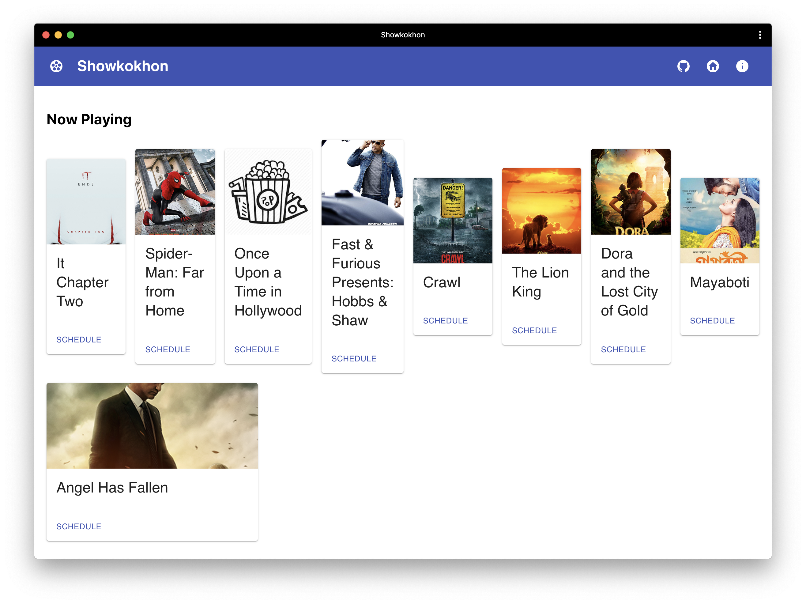

# Showkokhon Website
> Why make an app when you can make a website? ._.

## API in use
 - [showkokhon-core-api]()
 - [showkokhon-scraper-api]()

## Running locally
 - Clone and start the `core-api` service first
 - Clone this repo
 - Create a `.env` file at the project root and add the following info
 ```
 REACT_APP_API_ROOT_URL="http://localhost:3000"
 PORT=9090
 ```
 _Change the values accordingly with the core-api_

 - `yarn install` (no, I'm not using NPM, you can if you want to)
 - `yarn run start`

## Screenshot


## LICENSE
MIT